# Estrategias, casos de prueba y reporte de bugs de Swag Labs

## Descripción General

Las estrategias, casos de prueba y reporte de bugs iniciales se aplican de manera general a todos los usuarios otorgados. Después de especificar los generales, detallaremos de manera específica para cada usuario.

Tipos de usuarios: **standard_user**, **locked_out_user**, **problem_user**, **performance_glitch_user**, **error_user**, **visual_user**

### Estrategia de Pruebas

## Inicio de sesión

1. **Alcance de Pruebas:**
   - Se evaluará el módulo de inicio de sesión, centrándose en la validación de entradas, diseño y funcionalidad asociada.

2. **Tipos de Pruebas:**
   - Pruebas Funcionales:
     - Verificar la validación de entradas para el campo de usuario.
     - Evaluar el diseño y la interactividad del formulario.

3. **Enfoque:**
   - Pruebas Manuales: Inicialmente, realizar pruebas manuales para abordar la validación de entradas, diseño y funcionalidad.
   - Pruebas de Usabilidad: Evaluar la experiencia del usuario al interactuar con el formulario de inicio de sesión.

4. **Criterios de Aceptación:**
   - El sistema debe validar correctamente las entradas del usuario, mostrando mensajes de error específicos para casos como espacios en blanco.
   - El diseño del formulario debe ser coherente y funcional en diferentes dispositivos y tamaños de pantalla.
   - El formulario debe limpiar los campos de texto al hacer clic en la "x".
   - El sistema debe gestionar el tiempo de visualización de los mensajes de error de manera eficiente.

### Seguimiento de Bugs

1. **Herramienta de Seguimiento:**
   - Se utilizará Jira para documentar y hacer un seguimiento de los bugs encontrados.

2. **Procedimiento de Documentación:**
   - Cada bug será documentado con:
     - Paso a paso para reproducir el problema.
     - Comportamiento esperado vs. real.
     - Capturas de pantalla si es necesario.

### Creación de Casos de Prueba

1. **Caso de Prueba - Validación de Entradas:**

   **Precondiciones:**
   - Usuario accede al formulario de inicio de sesión.

   **Pasos:**
   1. Ingresar espacios en blanco en el campo de usuario.
   2. Hacer clic en "Iniciar Sesión".

   **Resultado Esperado:**
   - Debería mostrarse un mensaje indicando que no se permiten espacios en blanco en el campo de usuario.

2. **Caso de Prueba - Diseño y Funcionalidad del Formulario:**

   **Precondiciones:**
   - Usuario accede al formulario de inicio de sesión.

   **Pasos:**
   1. Evaluar el diseño y la disposición de los elementos en el formulario.
   2. Hacer clic en la "x" en cada campo de texto después de ingresar información.

   **Resultado Esperado:**
   - El diseño del formulario debe ser coherente y funcional en todos los dispositivos.
   - Hacer clic en la "x" debe limpiar el campo de texto asociado.

3. **Caso de Prueba - Ocultar Error al Recargar:**

   **Precondiciones:**
   - Usuario ha intentado iniciar sesión y ha ocurrido un error.
   - La página de inicio de sesión se recarga.

   **Pasos:**
   1. Verificar que el mensaje de error esté presente en la pantalla.
   2. Recargar la página.
   3. Verificar que los campos de entrada estén en blanco.
   4. Verificar que el mensaje de error esté oculto.

   **Resultado Esperado:**
   - Después de recargar la página, los campos de entrada deben estar en blanco.
   - El mensaje de error debe estar oculto, ya que los campos están en blanco.

### Reporte de Bugs

1. **Bug - Mensaje Incorrecto para Espacios en Blanco:**

   **Paso a Paso:**
   1. Ingresar espacios en blanco en el campo de usuario.
   2. Hacer clic en "Iniciar Sesión".

   **Comportamiento Esperado vs. Real:**
   - Esperado: Debería mostrar un mensaje indicando que no se permiten espacios en blanco.
   - Real: No se muestra el mensaje correcto.

2. **Bug - Problema con la Funcionalidad de Limpiar Campos:**

   **Paso a Paso:**
   1. Hacer clic en la "x" en un campo de texto después de ingresar información.

   **Comportamiento Esperado vs. Real:**
   - Esperado: Debería limpiar el campo de texto.
   - Real: El campo de texto no se limpia correctamente.

   - Ejemplo limpiar casilla "x"
  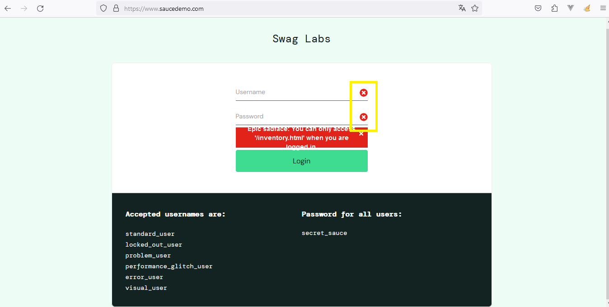

3. **Bug - Mensaje de Error Persistente Después de Recargar:**

   **Paso a Paso:**
   1. Usuario ha intentado iniciar sesión y ha ocurrido un error.
   2. La página de inicio de sesión se recarga.

   **Comportamiento Esperado vs. Real:**
   - **Esperado:** Después de recargar la página, los campos de entrada deben estar en blanco y el mensaje de error debe estar oculto.
   - **Real:** A pesar de que los campos de entrada están en blanco, el mensaje de error persiste y se muestra en la pantalla.

   **Capturas de Pantalla:**
   - Ejemplo de loguin con error
  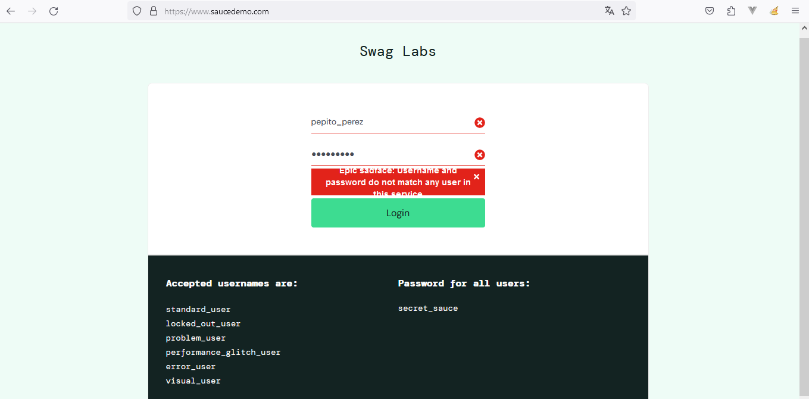
   - Ejemplo de loguin después de recargar 
  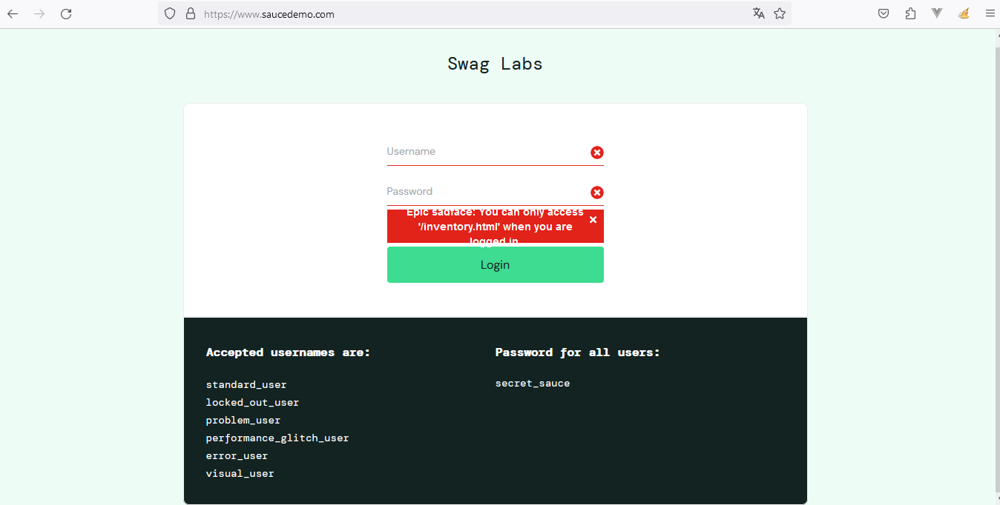

   **Prioridad y Gravedad:**
   - **Prioridad:** Alta
   - **Gravedad:** Media (ya que afecta la experiencia del usuario)

   ### Estrategia de Pruebas

   ## Usuario en sesión

1. **Alcance de Pruebas:**
   - Módulos a cubrir:
     - Módulo de inicio de sesión.
     - Módulo de menú superior o al lado derecho de la pantalla.
     - Módulo de visualización de usuario en sesión.

2. **Tipos de Pruebas:**
   - Pruebas Funcionales:
     - Validar la aparición del usuario en los menú después de iniciar sesión.
   - Pruebas de Usabilidad:
     - Evaluar la experiencia del usuario al identificar su sesión en el sistema.

3. **Enfoque:**
   - Pruebas Manuales:
     - Realizar pruebas manuales para verificar visualmente la aparición del usuario en los menú.

4. **Criterios de Aceptación:**
   - Después de iniciar sesión, el nombre o identificador del usuario debe aparecer en los menú.
   - La información del usuario en sesión debe ser precisa.

## Seguimiento de Bugs

1. **Herramienta de Seguimiento:**
   - Utilizar Jira para documentar y hacer un seguimiento de los problemas relacionados con la aparición del usuario en el menú superior.

2. **Procedimiento de Documentación:**
   - Cada bug será documentado con:
     - Paso a paso para reproducir el problema.
     - Comportamiento esperado vs. real.
     - Capturas de pantalla si es necesario.

## Creación de Casos de Prueba

1. **Caso de Prueba - Visualización de Usuario en los menú:**

   **Pasos:**
   1. Iniciar sesión en el sistema.
   2. Observar en los menú para la presencia del nombre de usuario.

   **Resultado Esperado:**
   - Después de iniciar sesión, el nombre o identificador del usuario debe aparecer en los menú.
   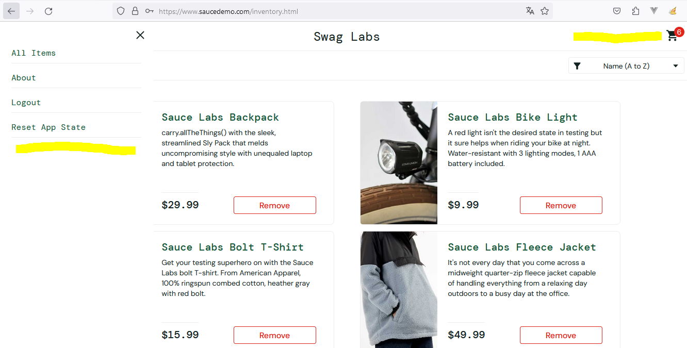

## Reporte de Bugs

1. **Bug - Usuario No Aparece en Menú Superior Después de Iniciar Sesión:**

   **Paso a Paso:**
   1. Iniciar sesión en el sistema.
   2. Observar la ausencia del nombre de usuario en los menú.

   **Comportamiento Esperado vs. Real:**
   - Esperado: Después de iniciar sesión, el nombre o identificador del usuario debería aparecer en los menú.
   - Real: El nombre de usuario no aparece en los menú.

   **Capturas de Pantalla:**
   - Capturas que muestra la ausencia del nombre de usuario en los menú.

   ### Estrategia de Pruebas

    ## Roles y permisos

1. **Alcance de Pruebas:**
   - Evaluar la asignación correcta de roles y persmisos a los usuarios.
   - Verificar que cada usuario tenga acceso solo a las funcionalidades autorizadas para su rol.

2. **Tipos de Pruebas:**
   - Pruebas Funcionales:
     - Verificar la funcionalidad específica asignada a cada rol.
   - Pruebas de Seguridad:
     - Evaluar la resistencia del sistema a intentos de acceso no autorizados.

3. **Enfoque:**
   - Pruebas Manuales:
     - Realizar pruebas manuales para evaluar la asignación correcta de roles.
     - Verificar los permisos de acceso para cada usuario.
   - Pruebas Automatizadas (Opcional):
     - Automatizar pruebas de asignación de roles y funcionalidades.

4. **Criterios de Aceptación:**
   - Cada usuario debe tener acceso solo a las funcionalidades autorizadas para su rol.
   - No se deben permitir accesos no autorizados.
   - El sistema debe manejar eficientemente la asignación de roles incluso con múltiples usuarios concurrentes.

### Seguimiento de Bugs

1. **Herramienta de Seguimiento:**
   - Utilizar Jira para documentar y hacer un seguimiento de los problemas relacionados con la asignación incorrecta de roles.

2. **Procedimiento de Documentación:**
   - Cada bug será documentado con:
     - Paso a paso para reproducir el problema.
     - Comportamiento esperado vs. real.
     - Capturas de pantalla si es necesario.

### Creación de Casos de Prueba

1. **Caso de Prueba - Asignación de Roles:**

   **Precondiciones:**
   - Usuarios con roles específicos asignados.

   **Pasos:**
   1. Iniciar sesión con un usuario de un rol específico.
   2. Verificar que las funcionalidades disponibles sean las correspondientes al rol.

   **Resultado Esperado:**
   - El usuario debe tener acceso solo a las funcionalidades autorizadas para su rol.

2. **Caso de Prueba - Pruebas de Seguridad:**

   **Pasos:**
   1. Intentar iniciar sesión con credenciales incorrectas.
   2. Intentar acceder a funcionalidades no autorizadas.

   **Resultado Esperado:**
   - El sistema debe resistir intentos de acceso no autorizado.
   - Deben mostrarse mensajes de error adecuados para credenciales incorrectas.

### Reporte de Bugs

1. **Bug - Asignación Incorrecta de Funcionalidades:**

   **Paso a Paso:**
   1. Usuario de un rol específico tiene acceso a funcionalidades no autorizadas.

   **Comportamiento Esperado vs. Real:**
   - Esperado: El usuario debería tener acceso solo a las funcionalidades autorizadas para su rol.
   - Real: El usuario puede acceder a funcionalidades en general.

   **Capturas de Pantalla:**
   - Ejemplo: usuario **performance_glitch_user**

     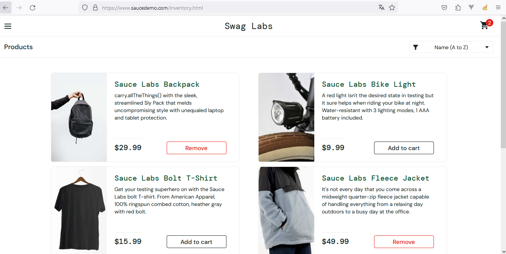
   - Ejemplo usuario **error_user**
   

### Estrategia de Pruebas

## Gestión de sesiones y carrito personalizado según usuario logueado

1. **Alcance de Pruebas:**
   - Módulos a cubrir:
     - Módulo de gestión de sesiones.
     - Módulo de carrito de compras personalizado por usuario.

2. **Tipos de Pruebas:**
   - Pruebas Funcionales:
     - Validar el cierre automático de sesión después de 10 minutos de inactividad.
     - Asegurar que el carrito de compras muestre solo los productos agregados por cada usuario.
   - Pruebas de Seguridad:
     - Verificar que la información del carrito de compras sea segura y no accesible por otros usuarios.

3. **Enfoque:**
   - Pruebas Manuales:
     - Realizar pruebas manuales para evaluar la gestión de sesiones y la personalización del carrito.

4. **Criterios de Aceptación:**
   - La sesión del usuario debe cerrarse automáticamente después de 10 minutos de inactividad.
   - El carrito de compras debe mostrar solo los productos agregados por el usuario correspondiente.

## Seguimiento de Bugs

1. **Herramienta de Seguimiento:**
   - Utilizar Jira para documentar y hacer un seguimiento de los problemas relacionados con la gestión de sesiones y la personalización del carrito.

2. **Procedimiento de Documentación:**
   - Cada bug será documentado con:
     - Paso a paso para reproducir el problema.
     - Comportamiento esperado vs. real.
     - Capturas de pantalla si es necesario.

## Creación de Casos de Prueba

1. **Caso de Prueba - Cierre Automático de Sesión:**

   **Pasos:**
   1. Iniciar sesión en el sistema.
   2. Esperar inactividad de más de 10 minutos.
   3. Intentar realizar una acción que requiera autenticación.

   **Resultado Esperado:**
   - La sesión debe cerrarse automáticamente.
   - Al intentar realizar una acción, se debe redirigir a la página de inicio de sesión.

2. **Caso de Prueba - Personalización del Carrito:**

   **Pasos:**
   1. Iniciar sesión con múltiples usuarios.
   2. Agregar productos al carrito con cada usuario.
   3. Verificar el contenido del carrito para cada usuario.

   **Resultado Esperado:**
   - Cada usuario debe ver solo los productos que agregó al carrito.
   - Los carritos de compras deben ser independientes y personalizados por usuario.

## Reporte de Bugs

1. **Bug - Sesión no se Cierra Después de Inactividad:**

   **Paso a Paso:**
   1. Permanecer inactivo por más de 10 minutos.
   2. La sesión no se cierra automáticamente.

   **Comportamiento Esperado vs. Real:**
   - Esperado: La sesión debe cerrarse automáticamente después de 10 minutos de inactividad.
   - Real: La sesión permanece abierta después de 10 minutos de inactividad.

2. **Bug - Carrito de Compras Muestra Productos Incorrectos:**

   **Paso a Paso:**
   1. Varios usuarios agregan productos al carrito.
   2. Al revisar el carrito, se muestran productos que no fueron agregados por el usuario actual.

   **Comportamiento Esperado vs. Real:**
   - Esperado: El carrito de compras debe mostrar solo los productos agregados por el usuario actual.
   - Real: El carrito de compras muestra productos de otros usuarios.

   **Capturas de Pantalla:**
   - Ejemplo productos: usuario **performance_glitch_user**
   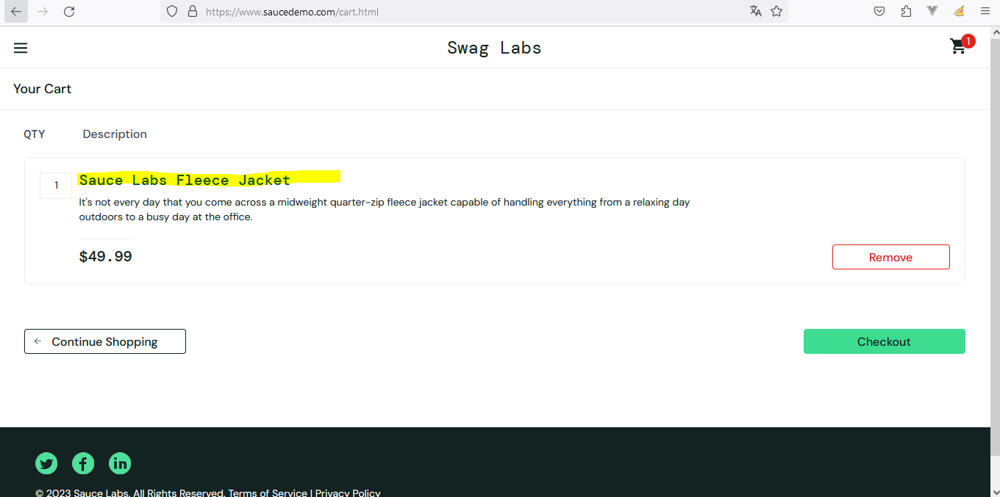
   - Ejemplo productos: usuario **error_user**
   

### Estrategia de Pruebas

## Pantalla **All Products**

1. **Alcance de Pruebas:**
   - Módulos a cubrir:
     - Módulo de visualización de productos.
     - Módulo de agregar productos al carrito.
     - Módulo de cantidad de productos y validaciones.
     - Módulo de búsqueda de productos por categoría y nombre.

2. **Tipos de Pruebas:**
   - Pruebas Funcionales:
     - Verificar la visualización correcta de productos.
     - Validar la funcionalidad de agregar productos al carrito con cantidades personalizadas.
     - Pruebas de Búsqueda: Evaluar la funcionalidad de búsqueda por categoría y nombre.
   
   - Pruebas de Usabilidad:
     - Evaluar la experiencia del usuario al agregar productos y realizar búsquedas.

3. **Enfoque:**
   - Pruebas Manuales:
     - Realizar pruebas manuales para evaluar la interfaz de usuario y la funcionalidad.

4. **Criterios de Aceptación:**
   - El sistema debe permitir agregar cualquier cantidad de productos al carrito.
   - Se deben aplicar validaciones para cantidades menores a 0 y existencias disponibles.
   - La función de búsqueda debe proporcionar resultados precisos y rápidos.
   - La interfaz de usuario debe ser intuitiva y permitir una experiencia de usuario fluida.

## Seguimiento de Bugs

1. **Herramienta de Seguimiento:**
   - Utilizar Jira para documentar y hacer un seguimiento de los problemas relacionados con la cantidad de productos y la búsqueda.

2. **Procedimiento de Documentación:**
   - Cada bug será documentado con:
     - Paso a paso para reproducir el problema.
     - Comportamiento esperado vs. real.
     - Capturas de pantalla si es necesario.

## Creación de Casos de Prueba

1. **Caso de Prueba - Agregar Producto al Carrito:**

   **Pasos:**
   1. Iniciar sesión y visualizar la lista de productos.
   2. Seleccionar un producto y verificar la opción de agregar al carrito.
   3. Ingresar una cantidad personalizada y agregar al carrito.

   **Resultado Esperado:**
   - El producto debe agregarse al carrito con la cantidad especificada.
   - Se debe mostrar una alerta informando que el producto se agregó correctamente.

   **Caso de Excepción - Exceder Límite de Existencias:**

   **Pasos:**
   1. Iniciar sesión y visualizar la lista de productos con existencias limitadas.
   2. Seleccionar un producto y verificar la opción de agregar al carrito.
   3. Ingresar una cantidad que exceda las existencias disponibles y agregar al carrito.

   **Resultado Esperado:**
   - Debe mostrar una alerta informando que la cantidad excede las existencias disponibles.

2. **Caso de Prueba - Validaciones de Cantidad:**

   **Pasos:**
   1. Iniciar sesión y visualizar la lista de productos.
   2. Seleccionar un producto y verificar la opción de agregar al carrito.
   3. Ingresar una cantidad menor a 0 y agregar al carrito.

   **Resultado Esperado:**
   - Debe mostrar un mensaje de error indicando que la cantidad no es válida.

3. **Caso de Prueba - Búsqueda de Productos:**

   **Pasos:**
   1. Iniciar sesión y visualizar la lista de productos.
   2. Utilizar la función de búsqueda por categoría y verificar los resultados.
   3. Utilizar la función de búsqueda por nombre y verificar los resultados.

   **Resultado Esperado:**
   - La búsqueda debe proporcionar resultados precisos según la categoría y/o el nombre del producto.

4. **Caso de Prueba - Remover Producto del Carrito:**

   **Pasos:**
   1. Iniciar sesión y visualizar el carrito de compras.
   2. Seleccionar un producto en el carrito y verificar la opción de remover.
   3. Hacer clic en la opción de remover.

   **Resultado Esperado:**
   - Debería mostrar una alerta de confirmación.
   - Al confirmar, el producto seleccionado debe ser eliminado del carrito.

   **Caso de Excepción - Cancelar Remover Producto:**

   **Pasos:**
   1. Iniciar sesión y visualizar el carrito de compras.
   2. Seleccionar un producto en el carrito y verificar la opción de remover.
   3. Hacer clic en la opción de remover.
   4. Cancelar la acción en la alerta de confirmación.

   **Resultado Esperado:**
   - No se elimina ningún producto del carrito.
   - La alerta de confirmación se cierra sin realizar cambios.

## Reporte de Bugs

1. **Bug - Cantidad No Validada al Agregar al Carrito:**

   **Paso a Paso:**
   1. Intentar agregar un producto con una cantidad no válida.

   **Comportamiento Esperado vs. Real:**
   - Esperado: Debe mostrar un mensaje de error indicando que la cantidad no es válida.
   - Real: El sistema permite agregar el producto sin verificar la cantidad y de un solo producto.

2. **Bug - Funcionalidad de Búsqueda No identificada:**

   **Paso a Paso:**
   1. Realizar una búsqueda por nombre o categoría y obtener resultados esperados.

   **Comportamiento Esperado vs. Real:**
   - Esperado: La búsqueda debe proporcionar resultados precisos según el nombre o categoría del producto.
   - Real: No existe funcionalidad de búsqueda que muestre resultados esperados o incorrectos.

   **Capturas de Pantalla:**
   - Ejemplo filtro
   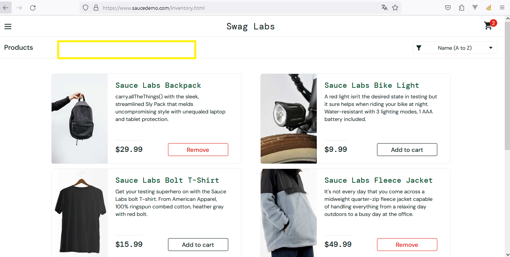

   ### Estrategia de Pruebas

   ## Carrito compra

1. **Alcance de Pruebas:**
   - Módulos a cubrir:
     - Módulo de visualización y gestión del carrito de compras.

2. **Tipos de Pruebas:**
   - Pruebas Funcionales:
     - Validar la correcta visualización de productos en el carrito.
     - Verificar la funcionalidad de modificar la cantidad de productos en el carrito.
     - Asegurar que se muestre la alerta de confirmación al remover un producto del carrito.

3. **Enfoque:**
   - Pruebas Manuales:
     - Realizar pruebas manuales para evaluar la interfaz del carrito y sus funcionalidades.

4. **Criterios de Aceptación:**
   - El carrito debe mostrar el valor unitario, la cantidad, valor total según cantidad y permitir modificar la cantidad de productos.
   - Se debe mostrar una alerta de confirmación al intentar remover un producto del carrito.
   - El valor total de la compra debe mostrarse y actualizarse dinámicamente al cambiar la cantidad de productos.

## Seguimiento de Bugs

1. **Herramienta de Seguimiento:**
   - Utilizar Jira para documentar y hacer un seguimiento de los problemas relacionados con la gestión del carrito de compras.

2. **Procedimiento de Documentación:**
   - Cada bug será documentado con:
     - Paso a paso para reproducir el problema.
     - Comportamiento esperado vs. real.
     - Capturas de pantalla si es necesario.

## Creación de Casos de Prueba

1. **Caso de Prueba - Modificación de Cantidad en el Carrito:**

   **Pasos:**
   1. Agregar productos al carrito.
   2. Verificar la visualización de la cantidad, valor unitario, valor total por producto y total de todos los productos en el carrito.
   3. Modificar la cantidad de productos en el carrito.

   **Resultado Esperado:**
   - La cantidad y el valor total en el carrito deben mostrarse y actualizarse correctamente.

2. **Caso de Prueba - Alerta al Remover Producto del Carrito:**

   **Pasos:**
   1. Agregar productos al carrito.
   2. Intentar remover uno o todos los productos del carrito.
   3. Verificar la aparición de la alerta de confirmación.

   **Resultado Esperado:**
   - Se debe mostrar una alerta solicitando confirmación antes de remover el producto del carrito.

## Reporte de Bugs

1. **Bug - No se Muestra Alerta al Remover Producto:**

   **Paso a Paso:**
   1. Intentar remover un producto del carrito.
   2. No se muestra la alerta de confirmación.

   **Comportamiento Esperado vs. Real:**
   - Esperado: Debería mostrarse una alerta solicitando confirmación.
   - Real: No se muestra la alerta al intentar remover el producto.

   ### Estrategia de Pruebas

   ## Error clic ícono carrito

1. **Alcance de Pruebas:**
   - Módulos a cubrir:
     - Módulo de autenticación.
     - Módulo de gestión de carrito de compras.

2. **Tipos de Pruebas:**
   - Pruebas Funcionales:
     - Validar el proceso de autenticación.
     - Evaluar el acceso y la interacción con el módulo de carrito de compras.

3. **Enfoque:**
   - Pruebas Manuales:
     - Realizar pruebas manuales para evaluar el proceso de autenticación y el acceso al carrito.

4. **Criterios de Aceptación:**
   - El usuario debe poder acceder al carrito después de iniciar sesión sin ser desconectado.
   - La información del carrito debe ser precisa y específica para cada usuario autenticado.

## Seguimiento de Bugs

1. **Herramienta de Seguimiento:**
   - Utilizar Jira para documentar y hacer un seguimiento de los problemas relacionados con el acceso al carrito después de la autenticación.

2. **Procedimiento de Documentación:**
   - Cada bug será documentado con:
     - Paso a paso para reproducir el problema.
     - Comportamiento esperado vs. real.
     - Capturas de pantalla si es necesario.

## Creación de Casos de Prueba

1. **Caso de Prueba - Acceso al Carrito Después de Iniciar Sesión:**

   **Pasos:**
   1. Iniciar sesión en el sistema.
   2. Navegar a la sección del carrito.
   3. Verificar el acceso correcto al carrito.

   **Resultado Esperado:**
   - El usuario debe poder acceder al carrito después de iniciar sesión sin ser desconectado.

##  Reporte de Bugs

1. **Bug - Desconexión al Acceder al Carrito Después de Iniciar Sesión:**

   **Paso a Paso:**
   1. Iniciar sesión en el sistema.
   2. Navegar a la sección del carrito.
   3. Ser desconectado inesperadamente.

   **Comportamiento Esperado vs. Real:**
   - Esperado: El usuario debería permanecer conectado al acceder al carrito después de iniciar sesión.
   - Real: El usuario es desconectado al intentar acceder al carrito.

   **Capturas de Pantalla:**
   - Ejemplo error al desconectar usuario: 
   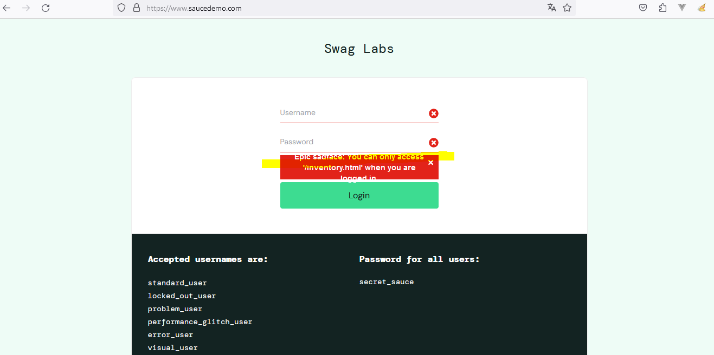

### Estrategia de Pruebas

## Opción Reset App State

1. **Alcance de Pruebas:**
   - Módulos a cubrir:
     - Módulo de gestión del carrito.
     - Módulo de botones en la lista de productos.
     - Módulo de reseteo del estado de la aplicación.

2. **Tipos de Pruebas:**
   - Pruebas Funcionales:
     - Validar la actualización de botones en la lista de productos después de resetear el carrito.
     - Evaluar la limpieza efectiva del carrito al hacer clic en "reset app state".
   - Pruebas de Usabilidad:
     - Evaluar la experiencia del usuario al interactuar con los botones y el reseteo del carrito.

3. **Enfoque:**
   - Pruebas Manuales:
     - Realizar pruebas manuales para evaluar la respuesta de la interfaz de usuario.

4. **Criterios de Aceptación:**
   - Al hacer clic en "reset app state", los botones en la lista de productos deben actualizarse correctamente.
   - El carrito debe limpiarse efectivamente sin necesidad de recargar la página.
   - Después de limpiar el carrito, se debe mostrar un mensaje indicando "Carrito vacío, agrega un producto".

## Seguimiento de Bugs

1. **Herramienta de Seguimiento:**
   - Utilizar Jira para documentar y hacer un seguimiento de los problemas relacionados con la actualización de botones y la limpieza del carrito.

2. **Procedimiento de Documentación:**
   - Cada bug será documentado con:
     - Paso a paso para reproducir el problema.
     - Comportamiento esperado vs. real.
     - Capturas de pantalla si es necesario.

## Creación de Casos de Prueba

1. **Caso de Prueba - Actualización de Botones en la Lista de Productos:**

   **Pasos:**
   1. Agregar productos al carrito.
   2. Ir a la lista de productos y verificar los botones.
   3. Hacer clic en "reset app state".
   4. Verificar que los botones se actualicen correctamente.

   **Resultado Esperado:**
   - Después de hacer clic en "reset app state", los botones en la lista de productos deben actualizarse y mostrar el estado correcto.

2. **Caso de Prueba - Limpieza del Carrito:**

   **Pasos:**
   1. Agregar productos al carrito.
   2. Hacer clic en "reset app state".
   3. Verificar que el carrito y la página de gestión de productos se limpie sin necesidad de recargarla.

   **Resultado Esperado:**
   - Después de hacer clic en "reset app state", el carrito debe limpiarse y mostrar el mensaje "Carrito vacío, agrega un producto".

## Reporte de Bugs

1. **Bug - Botones No Actualizados Después de Resetear el Carrito:**

   **Paso a Paso:**
   1. Agregar productos al carrito.
   2. Ir a la lista de productos general y verificar los botones.
   3. Hacer clic en "reset app state".

   **Comportamiento Esperado vs. Real:**
   - Esperado: Después de hacer clic en "reset app state", los botones en la lista de productos deberían actualizarse.
   - Real: Los botones no se actualizan correctamente después de resetear el carrito siguen apareciendo como Remove.

   **Capturas de Pantalla:**
   - Captura que muestra los botones no actualizados.
   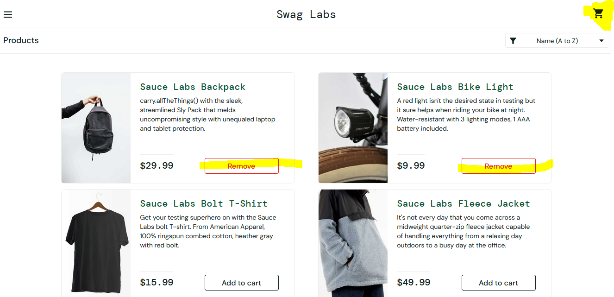

   2. **Bug - Lista productos en vista carrito no se resetea:**

   **Paso a Paso:**
   1. Agregar productos al carrito.
   2. Ir a la lista de productos añadidos al carrito.
   3. Hacer clic en "reset app state".

   **Comportamiento Esperado vs. Real:**
   - Esperado: Después de hacer clic en "reset app state", no debería aparecer ningún producto.
   - Real: Los productos no se eliminan correctamente después de resetear el carrito siguen apareciendo.

   **Capturas de Pantalla:**
   - Captura que muestra la lista no eliminada.
   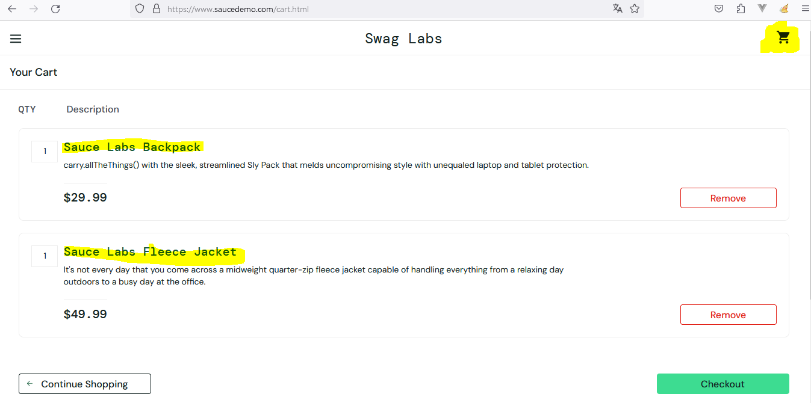

**********************************
   ### Estrategias, casos de prueba y reporte de bugs de Swag Labs por usuario específico 

## Descripción General

Las estrategias, casos de prueba y reporte de bugs que a continuación se detallan aplica para el usuario que sea especificado antes de redactar cada una. Es importante aclarar que lo detallado anteriomente aplica para todos los usuarios en general junto con estas que se detallan según al usuario que corresponda.

## Usuario **standard_user**

## Estrategia de Pruebas

1. **Alcance de Pruebas:**
   - Módulos a cubrir:
     - Módulo de checkout.
     - Módulo de validación del carrito al realizar el checkout.

2. **Tipos de Pruebas:**
   - Pruebas Funcionales:
     - Verificar la validación del carrito al hacer clic en "checkout".
   - Pruebas de Usabilidad:
     - Evaluar la experiencia del usuario al intentar realizar el checkout con el carrito vacío.

3. **Enfoque:**
   - Pruebas Manuales:
     - Realizar pruebas manuales para evaluar la interfaz de usuario y la funcionalidad de validación.

4. **Criterios de Aceptación:**
   - No se debe permitir el acceso a la pantalla de ingreso de datos si el carrito está vacío.
   - Al intentar realizar el checkout con el carrito vacío, debería aparecer una alerta informando al usuario que no puede realizar la compra.

## Seguimiento de Bugs

1. **Herramienta de Seguimiento:**
   - Utilizar Jira para documentar y hacer un seguimiento de los problemas relacionados con la validación del carrito en el proceso de checkout.

2. **Procedimiento de Documentación:**
   - Cada bug será documentado con:
     - Paso a paso para reproducir el problema.
     - Comportamiento esperado vs. real.
     - Capturas de pantalla si es necesario.

## Creación de Casos de Prueba

1. **Caso de Prueba - Validación de Carrito en Checkout:**

   **Pasos:**
   1. Agregar productos al carrito.
   2. Ir al proceso de checkout.
   3. Intentar ingresar los datos de envío con el carrito vacío.

   **Resultado Esperado:**
   - No se debe permitir ingresar los datos de envío y debería aparecer una alerta indicando que el carrito está vacío.

## Reporte de Bugs

1. **Bug - Permite Ingresar Datos con Carrito Vacío:**

   **Paso a Paso:**
   1. Agregar productos al carrito.
   2. Ir al proceso de checkout.
   3. Intentar ingresar los datos de envío con el carrito vacío.

   **Comportamiento Esperado vs. Real:**
   - Esperado: No se debe permitir ingresar los datos de envío y debería aparecer una alerta indicando que el carrito está vacío.
   - Real: Permite ingresar datos con el carrito vacío.

   **Capturas de Pantalla:**
   - Capturas que muestra la pantalla de ingreso de datos con el carrito vacío.
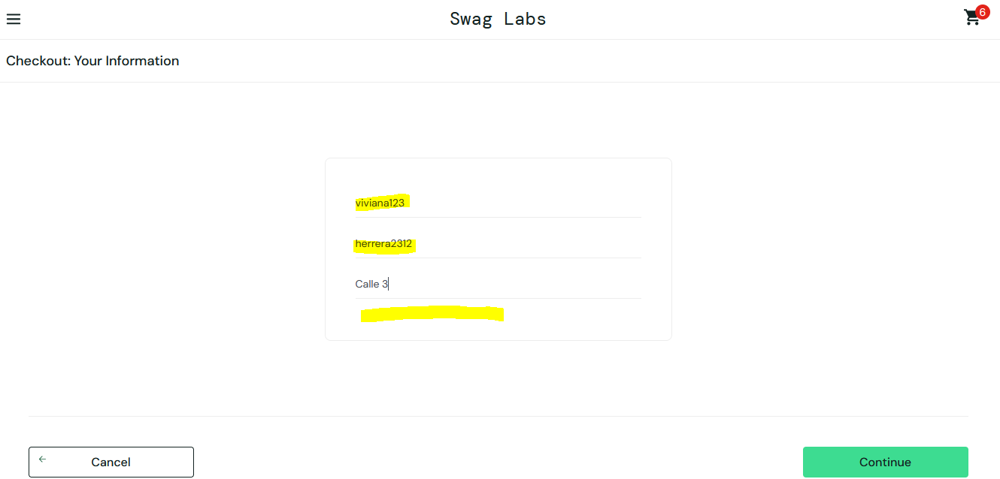

###  Estrategia de Pruebas

## Clic btn checkout

1. **Alcance de Pruebas:**
   - Módulos a cubrir:
     - Módulo de checkout.
     - Módulo de validación de datos personales.
     - Módulo de detalles de compra.
     - Módulo de método de pago.
     - Módulo de confirmación de compra.

2. **Tipos de Pruebas:**
   - Pruebas Funcionales:
     - Validar el formulario de datos personales.
     - Verificar los detalles de compra.
     - Probar la funcionalidad de eliminar productos.
     - Validar el proceso de selección del método de pago.
     - Confirmación de la compra.
   - Pruebas de Usabilidad:
     - Evaluar la experiencia del usuario en cada paso del checkout.

3. **Enfoque:**
   - Pruebas Manuales:
     - Realizar pruebas manuales para garantizar la calidad de la experiencia del usuario.
   - Pruebas de Validación:
     - Implementar pruebas de validación para asegurar la correcta integración de datos personales y detalles de compra.

4. **Criterios de Aceptación:**
   - El formulario de datos personales debe incluir campos para identificación y número de teléfono.
   - Se deben implementar validaciones para asegurar que en nombre y apellido no se permitan números.
   - La información personal debe aparecer en la pantalla de detalles de compra.
   - Debe ser posible eliminar productos desde la pantalla de detalles de compra.
   - El proceso de pago debe dirigir al usuario a una pantalla para seleccionar el método de pago.
   - El usuario debe recibir una confirmación de compra por correo electrónico.

## Seguimiento de Bugs

1. **Herramienta de Seguimiento:**
   - Utilizar Jira para documentar y hacer un seguimiento de los problemas encontrados durante el checkout.

2. **Procedimiento de Documentación:**
   - Cada bug será documentado con:
     - Paso a paso para reproducir el problema.
     - Comportamiento esperado vs. real.
     - Capturas de pantalla si es necesario.

## Creación de Casos de Prueba

1. **Caso de Prueba - Validación de Datos Personales:**

   **Pasos:**
   1. Ingresar al proceso de checkout.
   2. Completar el formulario de datos personales con nombre, apellido, identificación, número de teléfono.
   3. Validar que no se permitan números en nombre y apellido.

   **Resultado Esperado:**
   - Debe aparecer una alerta indicando que no se permiten números en nombre y apellido.

2. **Caso de Prueba - Detalles de Compra:**

   **Pasos:**
   1. Agregar productos al carrito.
   2. Iniciar el proceso de checkout.
   3. Validar la aparición de detalles de compra.

   **Resultado Esperado:**
   - Deben mostrarse detalles de compra, incluyendo valor unitario, cantidad, y valor total por producto.

3. **Caso de Prueba - Eliminación de Productos:**

   **Pasos:**
   1. Ingresar a la pantalla de detalles de compra.
   2. Intentar eliminar un producto.
   3. Confirmar que el producto se elimina correctamente.

   **Resultado Esperado:**
   - El producto debe eliminarse y ajustarse el valor total de la compra.

4. **Caso de Prueba - Confirmación de Compra:**

   **Pasos:**
   1. Completar el proceso de checkout.
   2. Seleccionar un método de pago.
   3. Confirmar la compra.

   **Resultado Esperado:**
   - El usuario debe recibir una confirmación por correo electrónico.

## Reporte de Bugs

1. **Bug - Fallo en Validación de Nombre y Apellido:**

   **Paso a Paso:**
   1. Ingresar al proceso de checkout.
   2. Completar el formulario de datos personales con números en nombre o apellido.

   **Comportamiento Esperado vs. Real:**
   - Esperado: Debe aparecer una alerta indicando que no se permiten números en nombre y apellido.
   - Real: No se muestra la alerta y se permite ingresar números.

   **Capturas de Pantalla:**
   - Capturas que muestre la falta de alerta y la entrada de números en nombre o apellido.

2. **Bug - No se Recibe Confirmación por Correo:**

   **Paso a Paso:**
   1. Completar el proceso de checkout.
   2. Confirmar la compra.

   **Comportamiento Esperado vs. Real:**
   - Esperado: El usuario debe recibir una confirmación por correo electrónico.
   - Real: No se recibe confirmación por correo.

## Usuario **locked_out_user**
- No se realizan pruebas al usuario **locked_out_user** porque se encuentra bloqueado en el sistema y no permite el inicio de sesión
    - Captura de pantalla con mensaje usuario bloqueado
    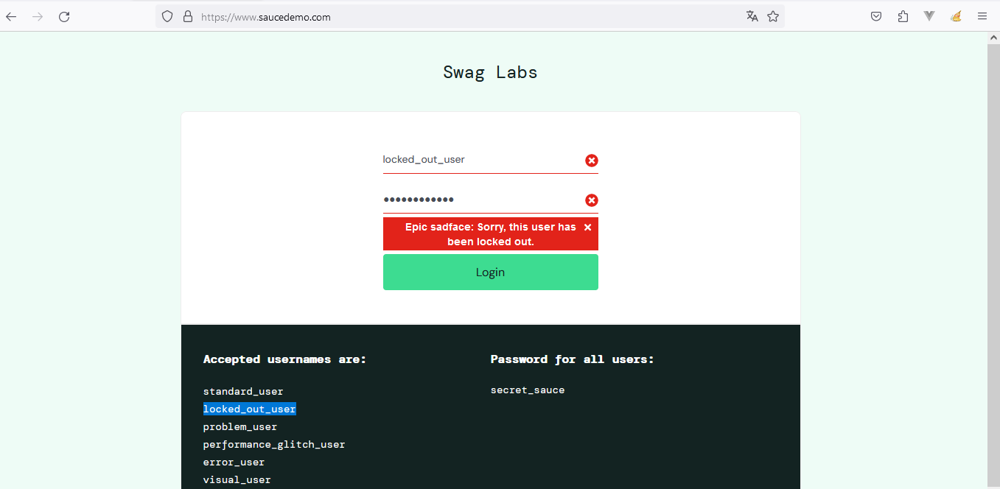

    ## Usuario **problem_user**

## Paso 2: Estrategia de Pruebas

1. **Alcance de Pruebas:**
   - Módulos a cubrir:
     - Módulo de visualización de productos.
     - Módulo de agregar productos al carrito.

2. **Tipos de Pruebas:**
   - Pruebas Funcionales:
     - Verificar la correcta visualización de imágenes de productos.
     - Validar la funcionalidad de agregar productos al carrito.

3. **Enfoque:**
   - Pruebas Manuales:
     - Realizar pruebas manuales para evaluar la interfaz de usuario y la funcionalidad.

4. **Criterios de Aceptación:**
   - Cada producto debe mostrar la imagen correspondiente.
   - Los productos seleccionados deben agregarse correctamente al carrito.

## Seguimiento de Bugs

1. **Herramienta de Seguimiento:**
   - Utilizar Jira para documentar y hacer un seguimiento de los problemas relacionados con la visualización de imágenes y la funcionalidad de agregar al carrito.

2. **Procedimiento de Documentación:**
   - Cada bug será documentado con:
     - Paso a paso para reproducir el problema.
     - Comportamiento esperado vs. real.
     - Capturas de pantalla si es necesario.

## Creación de Casos de Prueba

1. **Caso de Prueba - Visualización de Imágenes:**

   **Pasos:**
   1. Iniciar sesión y visualizar la lista de productos.
   2. Verificar la imagen mostrada para cada producto.

   **Resultado Esperado:**
   - Cada producto debe mostrar la imagen correspondiente.

2. **Caso de Prueba - Agregar al Carrito:**

   **Pasos:**
   1. Iniciar sesión y visualizar la lista de productos.
   2. Seleccionar un producto y hacer clic en "Agregar al Carrito".

   **Resultado Esperado:**
   - El producto seleccionado debe agregarse correctamente al carrito.

3. **Caso de Excepción - Producto no Agregado:**

   **Pasos:**
   1. Iniciar sesión y visualizar la lista de productos.
   2. Seleccionar un producto que no se agrega al carrito.
   3. Verificar si el producto se refleja en el carrito.

   **Resultado Esperado:**
   - El producto no debe agregarse al carrito, y no debe aparecer en el carrito.

## Reporte de Bugs

1. **Bug - Imagen Repetida en Productos:**

   **Paso a Paso:**
   1. Iniciar sesión y visualizar la lista de productos.

   **Comportamiento Esperado vs. Real:**
   - Esperado: Cada producto debe mostrar la imagen correspondiente.
   - Real: La misma imagen se repite en todos los productos.

   **Capturas de Pantalla:**
   - Captura que muestra la imagen repetida.
   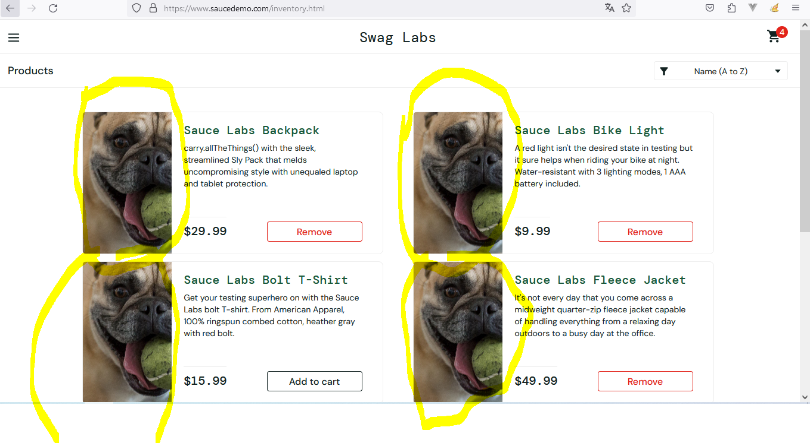

2. **Bug - Productos no Agregados al Carrito:**

   **Paso a Paso:**
   1. Iniciar sesión y visualizar la lista de productos.
   2. Seleccionar un producto y hacer clic en "Agregar al Carrito".

   **Comportamiento Esperado vs. Real:**
   - Esperado: El producto debe agregarse correctamente al carrito.
   - Real: El producto no se refleja en el carrito.

   **Capturas de Pantalla:**
   - Captura que muestra los productos no agregados al carrito.
    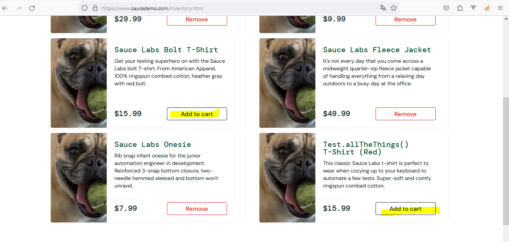

    ### Estrategia de Pruebas

1. **Alcance de Pruebas:**
   - Módulos a cubrir:
     - Módulo de checkout.
     - Módulo de validación del carrito al realizar el checkout.

2. **Tipos de Pruebas:**
   - Pruebas Funcionales:
     - Verificar la validación del carrito al hacer clic en "checkout".
   - Pruebas de Usabilidad:
     - Evaluar la experiencia del usuario al intentar realizar el checkout con el carrito vacío.

3. **Enfoque:**
   - Pruebas Manuales:
     - Realizar pruebas manuales para evaluar la interfaz de usuario y la funcionalidad de validación.

4. **Criterios de Aceptación:**
   - No se debe permitir el acceso a la pantalla de ingreso de datos si el carrito está vacío.
   - Al intentar realizar el checkout con el carrito vacío, debería aparecer una alerta informando al usuario que no puede realizar la compra.

## Seguimiento de Bugs

1. **Herramienta de Seguimiento:**
   - Utilizar Jira para documentar y hacer un seguimiento de los problemas relacionados con la validación del carrito en el proceso de checkout.

2. **Procedimiento de Documentación:**
   - Cada bug será documentado con:
     - Paso a paso para reproducir el problema.
     - Comportamiento esperado vs. real.
     - Capturas de pantalla si es necesario.

## Creación de Casos de Prueba

1. **Caso de Prueba - Validación de Carrito en Checkout:**

   **Pasos:**
   1. Agregar productos al carrito.
   2. Ir al proceso de checkout.
   3. Intentar ingresar los datos de envío con el carrito vacío.

   **Resultado Esperado:**
   - No se debe permitir ingresar los datos de envío y debería aparecer una alerta indicando que el carrito está vacío.

## Reporte de Bugs

1. **Bug - Permite Ingresar Datos con Carrito Vacío:**

   **Paso a Paso:**
   1. Agregar productos al carrito.
   2. Ir al proceso de checkout.
   3. Intentar ingresar los datos de envío con el carrito vacío.

   **Comportamiento Esperado vs. Real:**
   - Esperado: No se debe permitir ingresar los datos de envío y debería aparecer una alerta indicando que el carrito está vacío.
   - Real: Permite ingresar datos con el carrito vacío.

   **Capturas de Pantalla:**
   - Capturas que muestra la pantalla de ingreso de datos con el carrito vacío.

###  Estrategia de Pruebas

## Clic btn checkout

1. **Alcance de Pruebas:**
   - Módulos a cubrir:
     - Módulo de checkout.
     - Módulo de validación de datos personales.
     - Módulo de detalles de compra.
     - Módulo de método de pago.
     - Módulo de confirmación de compra.

2. **Tipos de Pruebas:**
   - Pruebas Funcionales:
     - Validar el formulario de datos personales.
     - Verificar los detalles de compra.
     - Probar la funcionalidad de eliminar productos.
     - Validar el proceso de selección del método de pago.
     - Confirmación de la compra.
   - Pruebas de Usabilidad:
     - Evaluar la experiencia del usuario en cada paso del checkout.

3. **Enfoque:**
   - Pruebas Manuales:
     - Realizar pruebas manuales para garantizar la calidad de la experiencia del usuario.
   - Pruebas de Validación:
     - Implementar pruebas de validación para asegurar la correcta integración de datos personales y detalles de compra.

4. **Criterios de Aceptación:**
   - El formulario de datos personales debe incluir campos para identificación y número de teléfono.
   - Se deben implementar validaciones para asegurar que en nombre y apellido no se permitan números.
   - La información personal debe aparecer en la pantalla de detalles de compra.
   - Debe ser posible eliminar productos desde la pantalla de detalles de compra.
   - El proceso de pago debe dirigir al usuario a una pantalla para seleccionar el método de pago.
   - El usuario debe recibir una confirmación de compra por correo electrónico.

## Seguimiento de Bugs

1. **Herramienta de Seguimiento:**
   - Utilizar Jira para documentar y hacer un seguimiento de los problemas encontrados durante el checkout.

2. **Procedimiento de Documentación:**
   - Cada bug será documentado con:
     - Paso a paso para reproducir el problema.
     - Comportamiento esperado vs. real.
     - Capturas de pantalla si es necesario.

## Creación de Casos de Prueba

1. **Caso de Prueba - Validación de Datos Personales:**

   **Pasos:**
   1. Ingresar al proceso de checkout.
   2. Completar el formulario de datos personales con nombre, apellido, identificación, número de teléfono.
   3. Validar que no se permitan números en nombre y apellido.

   **Resultado Esperado:**
   - Debe aparecer una alerta indicando que no se permiten números en nombre y apellido.

2. **Caso de Prueba - Detalles de Compra:**

   **Pasos:**
   1. Agregar productos al carrito.
   2. Iniciar el proceso de checkout.
   3. Validar la aparición de detalles de compra.

   **Resultado Esperado:**
   - Deben mostrarse detalles de compra, incluyendo valor unitario, cantidad, y valor total por producto.

3. **Caso de Prueba - Eliminación de Productos:**

   **Pasos:**
   1. Ingresar a la pantalla de detalles de compra.
   2. Intentar eliminar un producto.
   3. Confirmar que el producto se elimina correctamente.

   **Resultado Esperado:**
   - El producto debe eliminarse y ajustarse el valor total de la compra.

4. **Caso de Prueba - Confirmación de Compra:**

   **Pasos:**
   1. Completar el proceso de checkout.
   2. Seleccionar un método de pago.
   3. Confirmar la compra.

   **Resultado Esperado:**
   - El usuario debe recibir una confirmación por correo electrónico.

## Reporte de Bugs

1. **Bug - Fallo en Validación de Nombre y Apellido:**

   **Paso a Paso:**
   1. Ingresar al proceso de checkout.
   2. Completar el formulario de datos personales con números en nombre o apellido.

   **Comportamiento Esperado vs. Real:**
   - Esperado: Debe aparecer una alerta indicando que no se permiten números en nombre y apellido.
   - Real: No se muestra la alerta y se permite ingresar números.

   **Capturas de Pantalla:**
   - Capturas que muestre la falta de alerta y la entrada de números en nombre o apellido.

2. **Bug - No se Recibe Confirmación por Correo:**

   **Paso a Paso:**
   1. Completar el proceso de checkout.
   2. Confirmar la compra.

   **Comportamiento Esperado vs. Real:**
   - Esperado: El usuario debe recibir una confirmación por correo electrónico.
   - Real: No se recibe confirmación por correo.

## Usuario **performance_glitch_user**

## Estrategia de Pruebas

1. **Alcance de Pruebas:**
   - Módulos a cubrir:
     - Módulo de checkout.
     - Módulo de validación del carrito al realizar el checkout.

2. **Tipos de Pruebas:**
   - Pruebas Funcionales:
     - Verificar la validación del carrito al hacer clic en "checkout".
   - Pruebas de Usabilidad:
     - Evaluar la experiencia del usuario al intentar realizar el checkout con el carrito vacío.

3. **Enfoque:**
   - Pruebas Manuales:
     - Realizar pruebas manuales para evaluar la interfaz de usuario y la funcionalidad de validación.

4. **Criterios de Aceptación:**
   - No se debe permitir el acceso a la pantalla de ingreso de datos si el carrito está vacío.
   - Al intentar realizar el checkout con el carrito vacío, debería aparecer una alerta informando al usuario que no puede realizar la compra.

## Seguimiento de Bugs

1. **Herramienta de Seguimiento:**
   - Utilizar Jira para documentar y hacer un seguimiento de los problemas relacionados con la validación del carrito en el proceso de checkout.

2. **Procedimiento de Documentación:**
   - Cada bug será documentado con:
     - Paso a paso para reproducir el problema.
     - Comportamiento esperado vs. real.
     - Capturas de pantalla si es necesario.

## Creación de Casos de Prueba

1. **Caso de Prueba - Validación de Carrito en Checkout:**

   **Pasos:**
   1. Agregar productos al carrito.
   2. Ir al proceso de checkout.
   3. Intentar ingresar los datos de envío con el carrito vacío.

   **Resultado Esperado:**
   - No se debe permitir ingresar los datos de envío y debería aparecer una alerta indicando que el carrito está vacío.

## Reporte de Bugs

1. **Bug - Permite Ingresar Datos con Carrito Vacío:**

   **Paso a Paso:**
   1. Agregar productos al carrito.
   2. Ir al proceso de checkout.
   3. Intentar ingresar los datos de envío con el carrito vacío.

   **Comportamiento Esperado vs. Real:**
   - Esperado: No se debe permitir ingresar los datos de envío y debería aparecer una alerta indicando que el carrito está vacío.
   - Real: Permite ingresar datos con el carrito vacío.

   **Capturas de Pantalla:**
   - Capturas que muestra la pantalla de ingreso de datos con el carrito vacío.

###  Estrategia de Pruebas

## Clic btn checkout

1. **Alcance de Pruebas:**
   - Módulos a cubrir:
     - Módulo de checkout.
     - Módulo de validación de datos personales.
     - Módulo de detalles de compra.
     - Módulo de método de pago.
     - Módulo de confirmación de compra.

2. **Tipos de Pruebas:**
   - Pruebas Funcionales:
     - Validar el formulario de datos personales.
     - Verificar los detalles de compra.
     - Probar la funcionalidad de eliminar productos.
     - Validar el proceso de selección del método de pago.
     - Confirmación de la compra.
   - Pruebas de Usabilidad:
     - Evaluar la experiencia del usuario en cada paso del checkout.

3. **Enfoque:**
   - Pruebas Manuales:
     - Realizar pruebas manuales para garantizar la calidad de la experiencia del usuario.
   - Pruebas de Validación:
     - Implementar pruebas de validación para asegurar la correcta integración de datos personales y detalles de compra.

4. **Criterios de Aceptación:**
   - El formulario de datos personales debe incluir campos para identificación y número de teléfono.
   - Se deben implementar validaciones para asegurar que en nombre y apellido no se permitan números.
   - La información personal debe aparecer en la pantalla de detalles de compra.
   - Debe ser posible eliminar productos desde la pantalla de detalles de compra.
   - El proceso de pago debe dirigir al usuario a una pantalla para seleccionar el método de pago.
   - El usuario debe recibir una confirmación de compra por correo electrónico.

## Seguimiento de Bugs

1. **Herramienta de Seguimiento:**
   - Utilizar Jira para documentar y hacer un seguimiento de los problemas encontrados durante el checkout.

2. **Procedimiento de Documentación:**
   - Cada bug será documentado con:
     - Paso a paso para reproducir el problema.
     - Comportamiento esperado vs. real.
     - Capturas de pantalla si es necesario.

## Creación de Casos de Prueba

1. **Caso de Prueba - Validación de Datos Personales:**

   **Pasos:**
   1. Ingresar al proceso de checkout.
   2. Completar el formulario de datos personales con nombre, apellido, identificación, número de teléfono.
   3. Validar que no se permitan números en nombre y apellido.

   **Resultado Esperado:**
   - Debe aparecer una alerta indicando que no se permiten números en nombre y apellido.

2. **Caso de Prueba - Detalles de Compra:**

   **Pasos:**
   1. Agregar productos al carrito.
   2. Iniciar el proceso de checkout.
   3. Validar la aparición de detalles de compra.

   **Resultado Esperado:**
   - Deben mostrarse detalles de compra, incluyendo valor unitario, cantidad, y valor total por producto.

3. **Caso de Prueba - Eliminación de Productos:**

   **Pasos:**
   1. Ingresar a la pantalla de detalles de compra.
   2. Intentar eliminar un producto.
   3. Confirmar que el producto se elimina correctamente.

   **Resultado Esperado:**
   - El producto debe eliminarse y ajustarse el valor total de la compra.

4. **Caso de Prueba - Confirmación de Compra:**

   **Pasos:**
   1. Completar el proceso de checkout.
   2. Seleccionar un método de pago.
   3. Confirmar la compra.

   **Resultado Esperado:**
   - El usuario debe recibir una confirmación por correo electrónico.

## Reporte de Bugs

1. **Bug - Fallo en Validación de Nombre y Apellido:**

   **Paso a Paso:**
   1. Ingresar al proceso de checkout.
   2. Completar el formulario de datos personales con números en nombre o apellido.

   **Comportamiento Esperado vs. Real:**
   - Esperado: Debe aparecer una alerta indicando que no se permiten números en nombre y apellido.
   - Real: No se muestra la alerta y se permite ingresar números.

   **Capturas de Pantalla:**
   - Capturas que muestre la falta de alerta y la entrada de números en nombre o apellido.

2. **Bug - No se Recibe Confirmación por Correo:**

   **Paso a Paso:**
   1. Completar el proceso de checkout.
   2. Confirmar la compra.

   **Comportamiento Esperado vs. Real:**
   - Esperado: El usuario debe recibir una confirmación por correo electrónico.
   - Real: No se recibe confirmación por correo.

## USUARIO **error_user** 

## Estrategia de Pruebas

1. **Alcance de Pruebas:**
   - Módulos a cubrir:
     - Funcionalidad de filtros de productos.
     - Funcionalidad de agregar productos al carrito.

2. **Tipos de Pruebas:**
   - Pruebas Funcionales:
     - Verificar el funcionamiento de los filtros de productos.
     - Validar la funcionalidad de agregar productos al carrito.

3. **Enfoque:**
   - Pruebas Manuales:
     - Realizar pruebas manuales para evaluar la funcionalidad de los filtros y la adición de productos al carrito.

4. **Criterios de Aceptación:**
   - Los filtros de productos deben funcionar correctamente.
   - Todos los productos deben poder agregarse al carrito sin problemas.

## Seguimiento de Bugs

1. **Herramienta de Seguimiento:**
   - Utilizar Jira para documentar y hacer un seguimiento de los problemas relacionados con los filtros y la adición de productos al carrito.

2. **Procedimiento de Documentación:**
   - Cada bug será documentado con:
     - Paso a paso para reproducir el problema.
     - Comportamiento esperado vs. real.
     - Capturas de pantalla si es necesario.

## Creación de Casos de Prueba

1. **Caso de Prueba - Funcionalidad de Filtros:**

   **Pasos:**
   1. Iniciar sesión y visualizar la lista de productos.
   2. Seleccionar una opción del filtro y verificar los resultados.

   **Resultado Esperado:**
   - Los productos deben filtrarse correctamente según la opción seleccionada.

2. **Caso de Prueba - Agregar Productos al Carrito:**

   **Pasos:**
   1. Iniciar sesión y visualizar la lista de productos.
   2. Intentar agregar productos al carrito.

   **Resultado Esperado:**
   - Todos los productos deben agregarse al carrito sin problemas.

3. **Caso de Excepción - Error al Agregar Productos:**

   **Pasos:**
   1. Iniciar sesión y visualizar la lista de productos.
   2. Intentar agregar los productos que presentan problemas.
   3. Verificar si aparece algún mensaje de error.

   **Resultado Esperado:**
   - Debe mostrarse un mensaje de error o alerta si hay problemas al agregar productos.

## Reporte de Bugs

1. **Bug - Filtros no Funcionan:**

   **Paso a Paso:**
   1. Iniciar sesión y seleccionar una opción del filtro.

   **Comportamiento Esperado vs. Real:**
   - Esperado: Los productos deben filtrarse según la opción seleccionada.
   - Real: Aparece una alerta indicando "Sorting is broken! This error has been reported to Backtrace."

   **Capturas de Pantalla:**
   - Captura que muestra la alerta de error.
   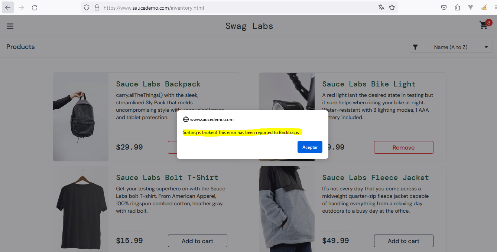

2. **Bug - Problemas al Agregar Productos:**

   **Paso a Paso:**
   1. Iniciar sesión e intentar agregar los productos problemáticos.

   **Comportamiento Esperado vs. Real:**
   - Esperado: Todos los productos deben agregarse al carrito.
   - Real: Algunos productos no se agregan al carrito y no aparece ninguna alerta de error.

   **Capturas de Pantalla:**
   - Captura que muestra los productos que no se agregan y la falta de mensajes de error.
  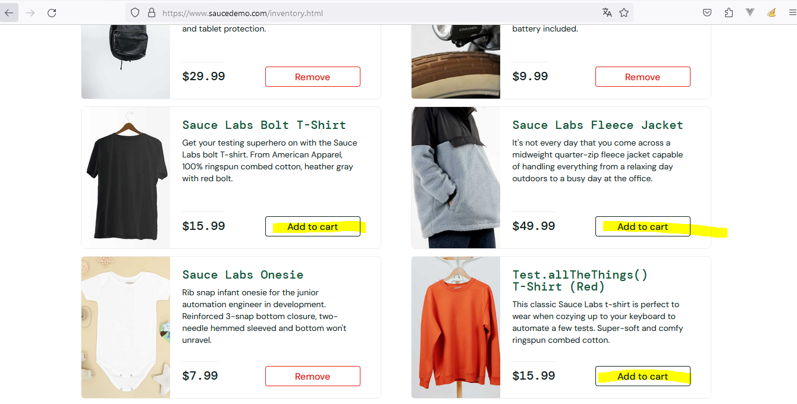

  ##  Estrategia de Pruebas

1. **Alcance de Pruebas:**
   - Módulos a cubrir:
     - Funcionalidad de checkout.
     - Detalles de la compra.
     - Proceso de pago y confirmación.

2. **Tipos de Pruebas:**
   - Pruebas Funcionales:
     - Validar el correcto funcionamiento del formulario de checkout.
     - Verificar la presentación de detalles de la compra.
     - Confirmar que el proceso de pago se realiza correctamente.

3. **Enfoque:**
   - Pruebas Manuales:
     - Realizar pruebas manuales para evaluar el flujo completo del proceso de compra.

4. **Criterios de Aceptación:**
   - El formulario de checkout debe permitir la entrada de datos válidos.
   - Los detalles de la compra deben mostrar información precisa y actualizada.
   - El proceso de pago debe completarse sin errores.

## Seguimiento de Bugs

1. **Herramienta de Seguimiento:**
   - Utilizar Jira para documentar y hacer un seguimiento de problemas relacionados con el formulario de checkout, detalles de compra y proceso de pago.

2. **Procedimiento de Documentación:**
   - Cada bug será documentado con:
     - Paso a paso para reproducir el problema.
     - Comportamiento esperado vs. real.
     - Capturas de pantalla si es necesario.

## Creación de Casos de Prueba

1. **Caso de Prueba - Formulario de Checkout:**

   **Pasos:**
   1. Agregar productos al carrito.
   2. Iniciar el proceso de checkout.
   3. Intentar ingresar un apellido con números.
   4. Intentar continuar con campos obligatorios vacíos.
   5. Completar el formulario con datos válidos y continuar.

   **Resultado Esperado:**
   - No se deben permitir números en el campo de apellido.
   - Debería haber validación para campos obligatorios.

2. **Caso de Prueba - Detalles de Compra:**

   **Pasos:**
   1. Agregar productos al carrito.
   2. Iniciar el proceso de checkout.
   3. Verificar los detalles de la compra.

   **Resultado Esperado:**
   - Los detalles deben mostrar información precisa de cada producto y el total de la compra.

3. **Caso de Prueba - Proceso de Pago:**

   **Pasos:**
   1. Completar el formulario de checkout.
   2. Continuar al proceso de pago.
   3. Seleccionar un método de pago y finalizar la compra.

   **Resultado Esperado:**
   - El proceso de pago debe completarse sin errores.

## Reporte de Bugs

1. **Bug - Problemas en el Formulario de Checkout:**

   **Paso a Paso:**
   1. Intentar ingresar un apellido con números.

   **Comportamiento Esperado vs. Real:**
   - Esperado: No se deben permitir números en el campo de apellido.
   - Real: El sistema permite ingresar números en el campo de apellido.
## Reporte de Bugs

2. **Bug - Problemas para escribir en el input de Last Name:**

   **Paso a Paso:**
   1. Intentar ingresar un apellido.

   **Comportamiento Esperado vs. Real:**
   - Esperado: Debe permitir digitar información.
   - Real: El sistema no permite ingresar información en el input de apellido.

   **Capturas de Pantalla:**
   - Captura que muestra no poder digitar información en last name
   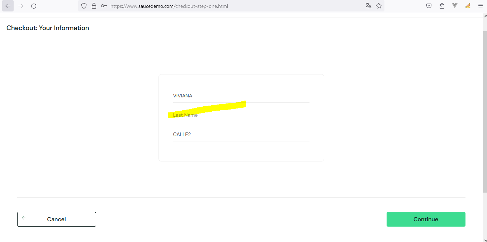

   ## USUARIO **visual_user** 

   ## Estrategia de Pruebas

1. **Alcance de Pruebas:**
   - Módulos a cubrir:
     - Diseño del menú.
     - Presentación de productos.
     - Interfaz de gestión del carrito.

2. **Tipos de Pruebas:**
   - Pruebas Funcionales:
     - Validar el diseño y la presentación de la interfaz de usuario.

3. **Enfoque:**
   - Pruebas Manuales:
     - Revisar manualmente la interfaz de usuario para identificar problemas de diseño.

4. **Criterios de Aceptación:**
   - El icono del carrito de compras debe aparecer correctamente ubicado en el menú.
   - Las imágenes de los productos deben corresponder a los productos mencionados.
   - La presentación de los productos en la lista debe ser uniforme.

## Seguimiento de Bugs

1. **Herramienta de Seguimiento:**
   - Utilizar Jira para documentar y hacer un seguimiento de problemas relacionados con el diseño y la presentación.

2. **Procedimiento de Documentación:**
   - Cada bug será documentado con:
     - Paso a paso para reproducir el problema.
     - Comportamiento esperado vs. real.
     - Capturas de pantalla si es necesario.

## Creación de Casos de Prueba

1. **Caso de Prueba - Diseño del Menú:**

   **Pasos:**
   1. Iniciar sesión y verificar el icono del carrito en el menú.

   **Resultado Esperado:**
   - El icono del carrito debe estar correctamente ubicado en el menú.

2. **Caso de Prueba - Presentación de Productos:**

   **Pasos:**
   1. Navegar por la lista de productos y verificar la imagen del primer producto.

   **Resultado Esperado:**
   - La imagen del primer producto debe corresponder al producto mencionado.

3. **Caso de Prueba - Interfaz de Gestión del Carrito:**

   **Pasos:**
   1. Agregar productos al carrito y verificar el diseño en la interfaz de gestión del carrito.
   2. Acceder a la gestión de productos en el carrito y verificar la posición del botón "Checkout".

   **Resultado Esperado:**
   - El diseño en la interfaz de gestión del carrito debe ser coherente.
   - El botón "Checkout" debe estar correctamente ubicado en la parte inferior de la pantalla.

## Reporte de Bugs

1. **Bug - Icono del Carrito Desubicado:**

   **Paso a Paso:**
   1. Iniciar sesión y verificar la ubicación del icono del carrito.

   **Comportamiento Esperado vs. Real:**
   - Esperado: El icono del carrito debe estar correctamente ubicado en el menú.
   - Real: El icono del carrito no está en la posición adecuada.

   **Capturas de Pantalla:**
   - Captura que muestra la ubicación incorrecta del icono del carrito.
   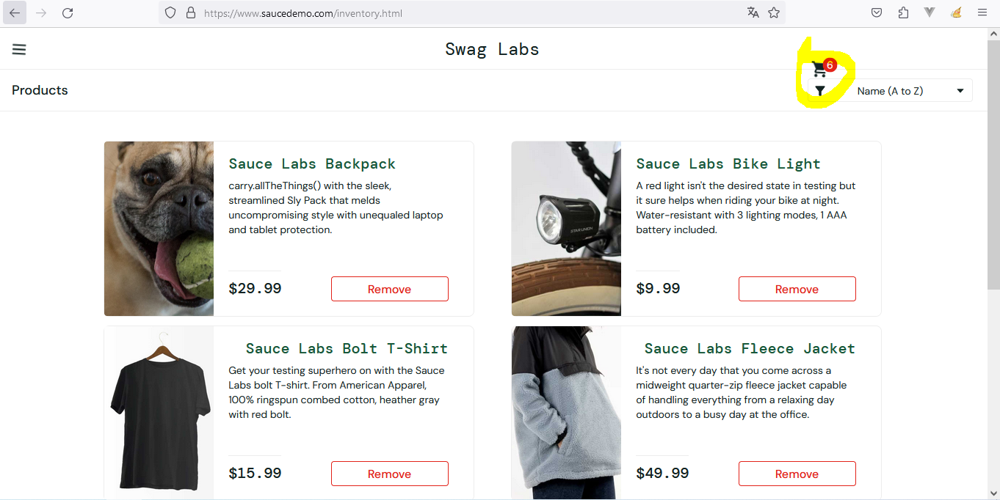

2. **Bug - Imagen Incorrecta del Primer Producto:**

   **Paso a Paso:**
   1. Navegar por la lista de productos y verificar la imagen del primer producto.

   **Comportamiento Esperado vs. Real:**
   - Esperado: La imagen del primer producto debe corresponder al producto mencionado.
   - Real: La imagen no coincide con el producto.

   **Capturas de Pantalla:**
   - Captura que muestra la imagen incorrecta del primer producto.
   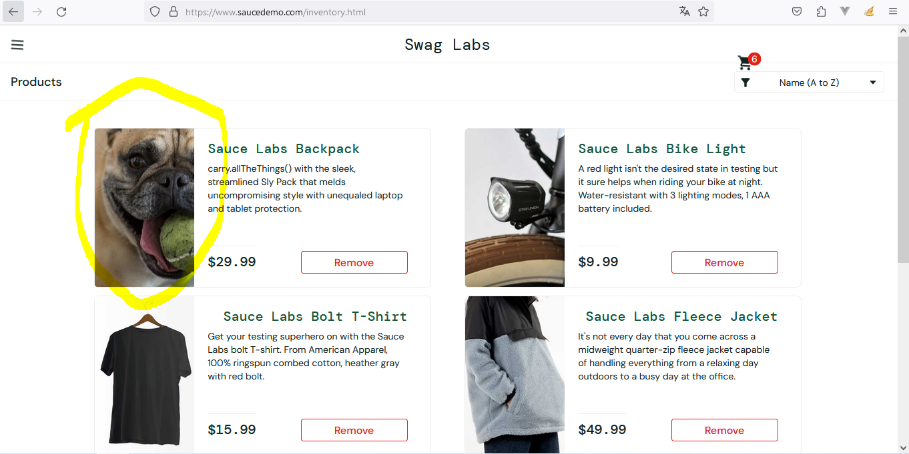

3. **Bug - Posición Incorrecta del Botón "Checkout":**

   **Pasos:**
   1. Agregar productos al carrito y verificar el diseño en la interfaz de gestión del carrito.
   2. Acceder a la gestión de productos en el carrito y verificar la posición del botón "Checkout".

   **Comportamiento Esperado vs. Real:**
   - Esperado: El botón "Checkout" debe estar correctamente ubicado en la parte inferior de la pantalla.
   - Real: El botón "Checkout" se encuentra en una posición incorrecta.

   **Capturas de Pantalla:**
   - Capturas que muestren la posición incorrecta del botón "Checkout".
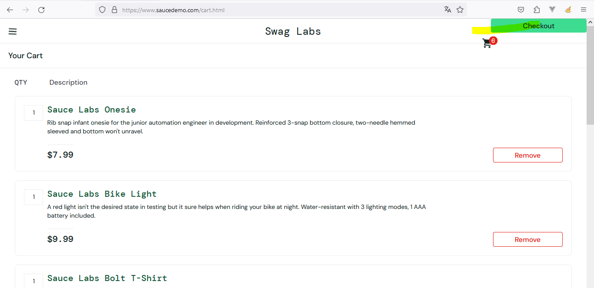

